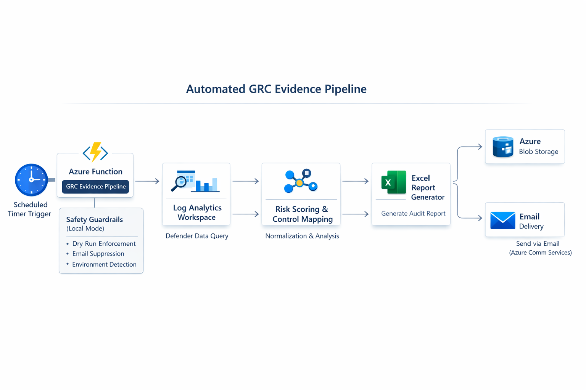
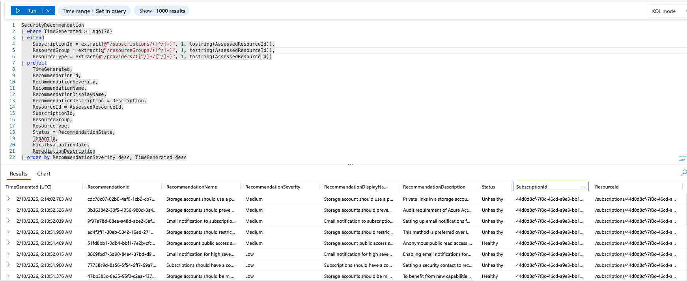
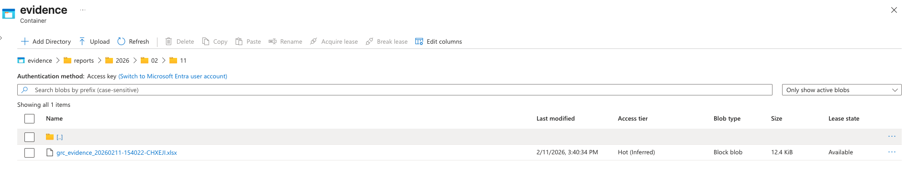
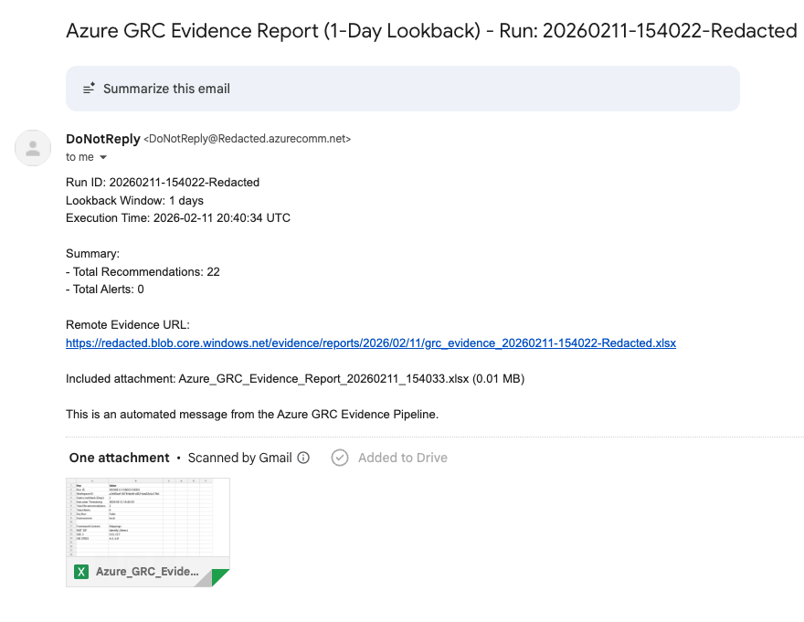
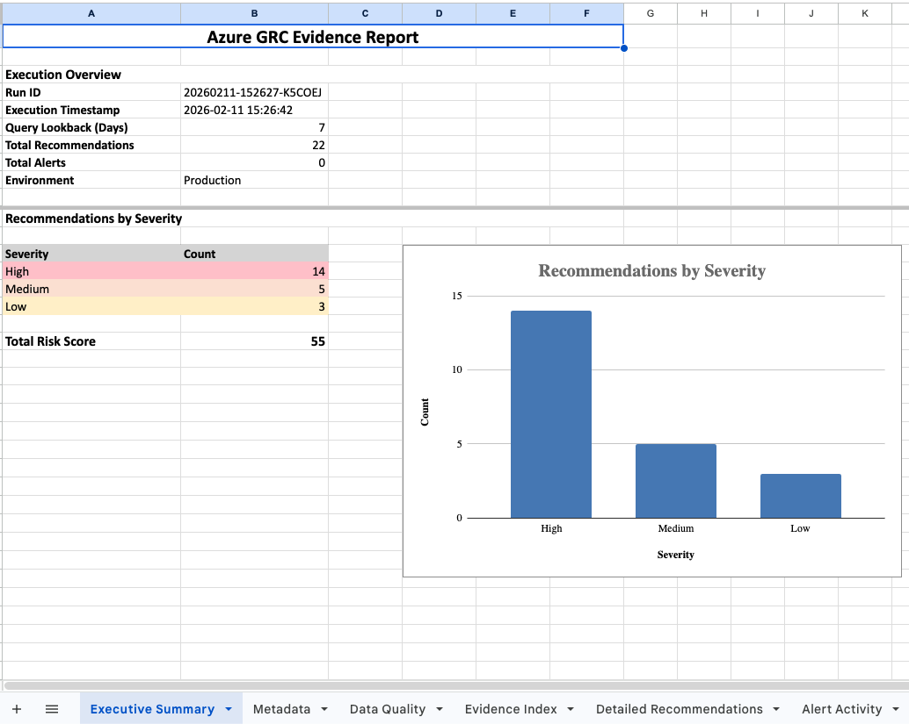
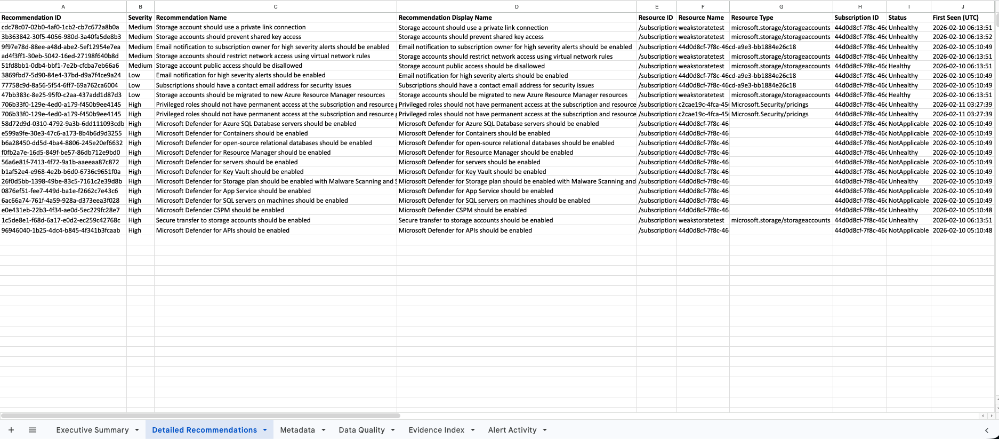
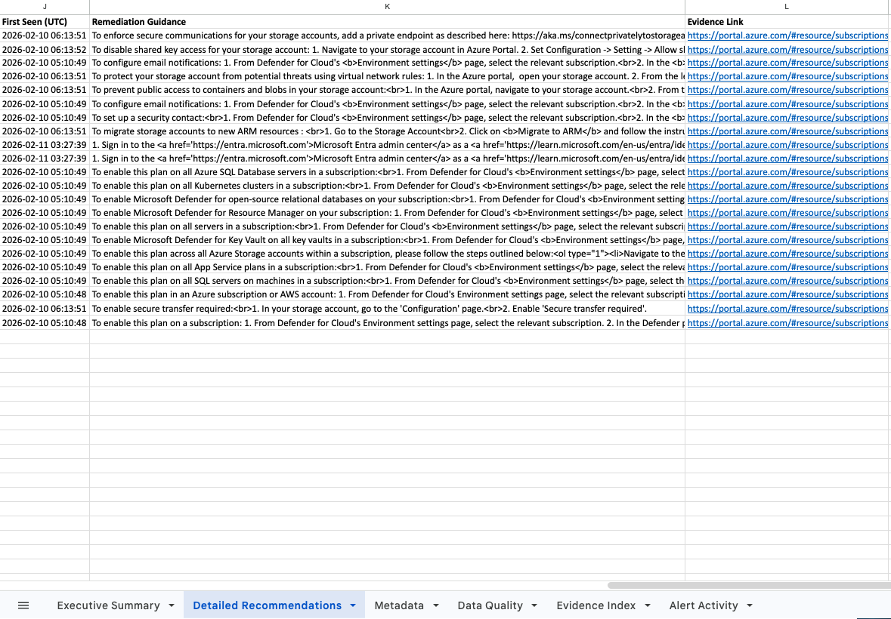

# Azure GRC Evidence Automation Pipeline

## Executive Summary

This tool automatically pulls security recommendations from Microsoft Defender for Cloud and turns them into structured, audit-ready reports.

A scheduled Azure Function queries Log Analytics, processes and normalizes the findings, applies risk scoring and control mapping, and then generates an Excel report. The report is automatically stored in Azure Blob Storage and can be distributed via email.

Instead of manually exporting screenshots or pulling data for audits, this pipeline converts live cloud security data into usable GRC evidence.

---

## The Problem

In most Azure environments:

- Security findings live in Defender for Cloud  
- Compliance expectations live in frameworks (NIST, CIS, SOC 2)  
- Audit evidence lives in spreadsheets  
- Reporting is manual and inconsistent  

There is no automated governance bridge between cloud posture data and structured compliance evidence.

This pipeline solves:

- Manual evidence gathering  
- Inconsistent audit artifacts  
- Delayed reporting cycles  
- Poor visibility into recommendation trends  
- Lack of structured documentation for compliance reviews  

---

## Architecture Overview
**Execution Flow**

Scheduled Timer Trigger  
→ Azure Function (Serverless Orchestrator)  
→ Log Analytics (Defender for Cloud – KQL Queries)  
→ Risk Scoring & Control Mapping Engine  
→ Excel Evidence Report Generation  

Post-Processing Outputs:
- Store report in Azure Blob Storage  
- Send report via Azure Communication Services (Email)  

The solution is fully serverless and designed for automated, recurring governance evidence generation.



---

## Live Function Execution

The pipeline runs as a scheduled Azure Function using a CRON-based timer trigger.

Below is an example execution log showing the automated run:

- Timer trigger activation  
- Log Analytics query execution  
- Report generation  
- Successful completion  

```[Trigger]
Weekly GRC Evidence Timer
Schedule: Sunday 13:00 UTC
Environment: local
Safety Guardrails Applied: Yes
Dry Run: False
Email Enabled: True
Lookback Window: 7 days

[Runner]
Run ID: 20260211-133444-FUNC

[Authentication]
Azure credentials verified successfully
Log Analytics connection test successful

[Discovery]
Workspace security tables detected:
- SecurityRecommendation

[Data Collection]
Recommendation Summary: 6 rows
Detailed Recommendations: 22 rows
Alert Activity: 0 rows

[Validation]
Recommendations mapped to strict models: 22
Critical fields present: Yes
Data Quality Status: Good

[Artifact Generation]
Excel report generated:
/tmp/Azure_GRC_Evidence_Report_20260211_133455.xlsx

[Execution Summary]
Status: Success
Duration: 10.78s
Run ID: 20260211-133444-FUNC
Recommendations: 22
Alerts: 0
Blob Upload: Success
Email Delivery: Success

[Function Result]
WeeklyGrcEvidenceTimer: Succeeded
```

---
# Query Layer – Defender for Cloud (KQL)

This pipeline executes structured KQL queries against the Log Analytics workspace to retrieve Microsoft Defender for Cloud security recommendations.

The query normalizes key fields, extracts resource metadata, and prepares structured output for risk scoring and governance reporting.

Below is an example query executed by the function



---

## Key Capabilities

### Automated Evidence Collection
- Executes structured KQL queries against Microsoft Defender for Cloud data
- Normalizes inconsistent security telemetry into predictable schema
- Extracts severity, remediation guidance, subscription context, and resource metadata
- Eliminates manual export and screenshot-based audit workflows

### Governance-Ready Reporting
- Generates structured, multi-tab Excel reports
- Includes Executive Summary, Detailed Recommendations, Metadata, Data Quality, and Evidence Index
- Designed for audit review and stakeholder consumption
- Standardized format across reporting cycles

### Risk Context Integration
- Severity-based prioritization
- Recommendation state tracking (Healthy / Unhealthy / NotApplicable)
- Configurable lookback window (`DAYS_LOOKBACK`)
- Aggregated risk scoring model
- Data quality validation before report generation

### Environment Guardrails
- Automatic detection of local vs production execution
- Forced dry-run mode in non-production
- Controlled email behavior
- Explicit override flags for safe testing

### Authentication Model
- Uses `DefaultAzureCredential`
- Supports Azure CLI for local development
- Ready for Managed Identity in production
- No hardcoded secrets or credential leakage

---

## Deployment Model

This solution is designed as a fully serverless governance automation pipeline.

### Runtime
- Azure Functions (Python)
- Timer Trigger (CRON-based weekly execution)
- Event-driven execution model

### Data Source
- Log Analytics Workspace
- Microsoft Defender for Cloud tables (`SecurityRecommendation`)

### Artifact Storage
- Azure Blob Storage
- Structured container hierarchy for evidence retention
- Hot access tier for frequent audit retrieval

### Distribution Layer
- Azure Communication Services (Email)
- Automated delivery of audit-ready artifacts
- Includes remote blob URL and attached report

### Identity & Security
- `DefaultAzureCredential` authentication model
- Azure CLI for local execution
- Managed Identity for production
- No embedded secrets

The function is optimized for scheduled weekly execution but supports manual invocation for testing and validation.

### Artifact Retention

Generated reports are automatically stored in Azure Blob Storage for governance traceability and historical review.



### Automated Distribution

Reports can be automatically delivered via email with Azure Communication Services:



---

## Example Output

The generated Excel report includes:

- Executive Summary (Run metadata + risk overview)
- Recommendations by Severity (Chart + counts)
- Detailed Recommendations (Structured table)
- Evidence Index (Framework context mapping)
- Data Quality Validation
- Optional Alert Activity (if present)

### Executive Summary (Report Overview)

High-level posture snapshot including severity breakdown and risk scoring:



### Detailed Recommendations (Structured Output)

Normalized Defender for Cloud findings prepared for governance review:




Reports are saved to:

- Local `/tmp` directory during dry-run mode
- Azure Blob Storage in production mode
- Delivered via email when enabled

---

## Configuration

Required environment variables:

- `LOG_ANALYTICS_WORKSPACE_ID`
- `AZURE_STORAGE_ACCOUNT_URL`
- `AZURE_STORAGE_CONTAINER`
- `AZURE_COMMUNICATION_CONNECTION_STRING`
- `TO_EMAIL`
- `DAYS_LOOKBACK`
- `ENV`

Local configuration is handled via `local.settings.json`.

---

## Governance Use Cases

This pipeline supports real-world governance and compliance workflows:

- Automated SOC 2 evidence generation for continuous control monitoring
- Recurring board-level posture reporting with severity and risk context
- Structured audit artifacts aligned to framework expectations
- Risk committee reporting with severity distribution and trend visibility
- Standardized cloud security documentation across subscriptions
- Reduced manual evidence gathering during audit cycles

By converting Defender for Cloud telemetry into structured artifacts, this tool enables security, compliance, and leadership teams to operate from the same data source.

---

## Roadmap

Planned Enhancements:

- Risk score trend analytics with historical tracking
- Native framework tagging (NIST CSF, CIS, SOC 2 control IDs)
- Multi-subscription and multi-tenant aggregation
- Power BI integration for executive dashboards
- API endpoint for real-time dashboard consumption
- Policy coverage gap analysis
- Evidence retention lifecycle automation
- Advanced risk scoring model incorporating exposure and criticality

---

## Why This Matters

Cloud environments generate security telemetry continuously, but governance processes remain largely manual.

This gap creates:

- Audit friction
- Inconsistent reporting
- Delayed risk visibility
- Executive blind spots

This project demonstrates how security telemetry can be operationalized into structured governance artifacts using serverless automation and secure identity patterns.

It reflects a practical implementation of GRC engineering — bridging cloud security data with compliance, audit, and executive reporting requirements in a modern Azure environment.
